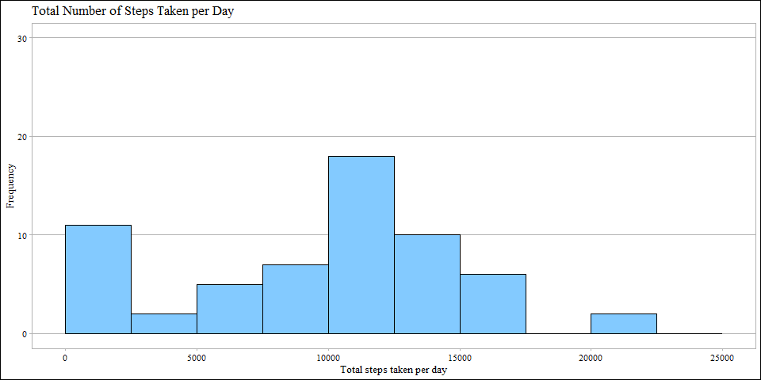
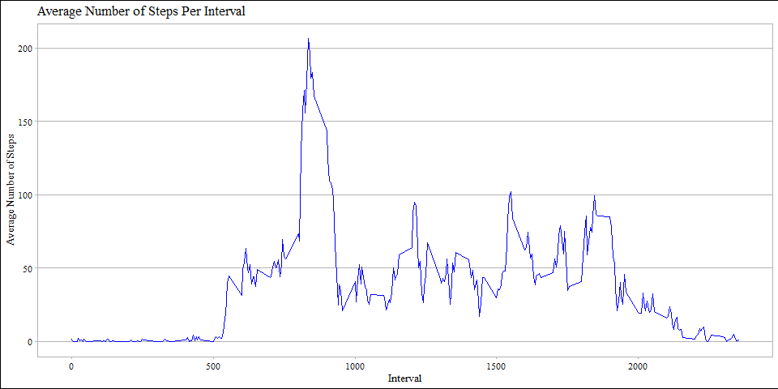
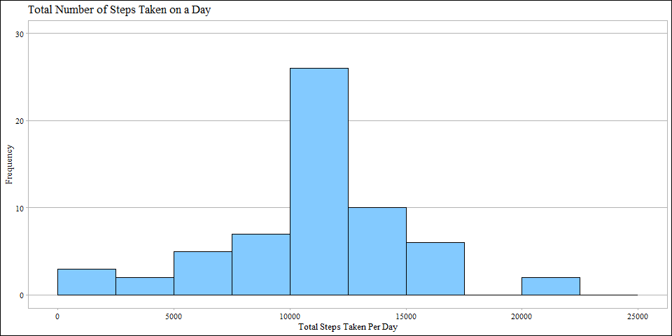
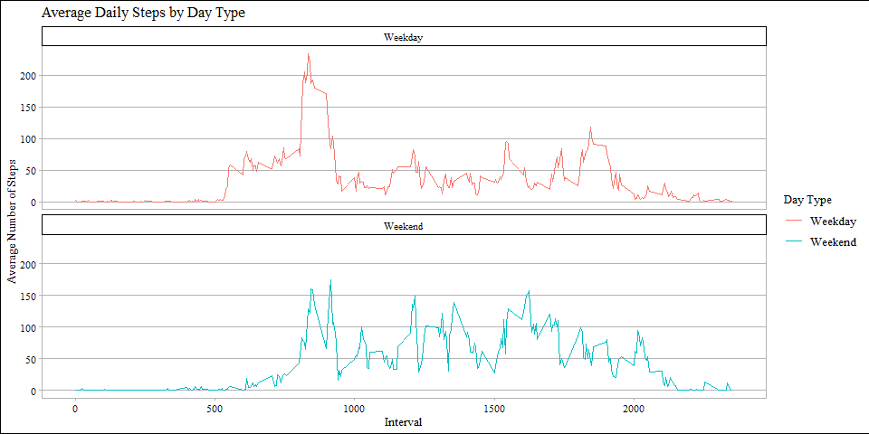

## Loading and preprocessing the data


```r
# Global options
knitr::opts_chunk$set(echo = TRUE, warning = FALSE, fig.width = 10, fig.height = 5,
                      fig.keep = 'all' ,fig.path = 'figures\ ', dev = 'png')
# To be able to work on all NonEnglish systems
invisible(Sys.setlocale("LC_ALL","English")) #invisible hides output
# Loading packages
library(ggplot2)
library(ggthemes)
suppressMessages(library(lubridate))
```


```r
# Unzipping the file and reading it
unzip("activity.zip")
activity <- read.csv("activity.csv")
# Setting date format to help get the weekdays of the dates
activity$date <- as_date(activity$date)
# Getting the days of all the dates on the dataset
day <- weekdays(activity$date)
# Combining the dataset with the weekday of the dates
activity <- cbind(activity, day)
# Viewing the processed data
summary(activity)
```

```
##      steps             date               interval          day           
##  Min.   :  0.00   Min.   :2012-10-01   Min.   :   0.0   Length:17568      
##  1st Qu.:  0.00   1st Qu.:2012-10-16   1st Qu.: 588.8   Class :character  
##  Median :  0.00   Median :2012-10-31   Median :1177.5   Mode  :character  
##  Mean   : 37.38   Mean   :2012-10-31   Mean   :1177.5                     
##  3rd Qu.: 12.00   3rd Qu.:2012-11-15   3rd Qu.:1766.2                     
##  Max.   :806.00   Max.   :2012-11-30   Max.   :2355.0                     
##  NA's   :2304
```

## What is mean total number of steps taken per day?


```r
# Calculating total steps taken on a day
activityTotalSteps <- with(activity, aggregate(steps, by = list(date), sum, na.rm = TRUE))
# Giving col names
names(activityTotalSteps) <- c("Date", "Steps")
# Converting the data set into a data frame to be able to use ggplot2
totalStepsdf <- data.frame(activityTotalSteps)
# Plotting a histogram using ggplot2
g <- ggplot(totalStepsdf, aes(x = Steps)) + 
  geom_histogram(breaks = seq(0, 25000, by = 2500), fill = "#83CAFF", col = "black") + 
  ylim(0, 30) + 
  xlab("Total steps taken per day") + 
  ylab("Frequency") + 
  ggtitle("Total Number of Steps Taken per Day") + 
  theme_calc(base_family = "serif")
print(g)
```

<!-- -->

The mean of the total number of steps taken per day is:

```r
mean(activityTotalSteps$Steps)
```

```
## [1] 9354.23
```

The median of the total number of steps taken per day is:

```r
median(activityTotalSteps$Steps)
```

```
## [1] 10395
```

## What is the average daily activity pattern?


```r
# Calculating the average number of steps taken, averaged across all days by 5-min intervals.
averageDailyActivity <- aggregate(activity$steps, by = list(activity$interval), 
                                  FUN = mean, na.rm = TRUE)
# Giving col names
names(averageDailyActivity) <- c("Interval", "Mean")
# Converting the data set into a dataframe
averageActivitydf <- data.frame(averageDailyActivity)
# Plotting on ggplot2
da <- ggplot(averageActivitydf, mapping = aes(Interval, Mean)) + 
  geom_line(col = "blue") +
  xlab("Interval") + 
  ylab("Average Number of Steps") + 
  ggtitle("Average Number of Steps Per Interval") +
  theme_calc(base_family = "serif")
  
print(da)
```

<!-- -->

Which 5-minute interval, on average across all the days in the dataset, contains the maximum number of steps?

```r
averageDailyActivity[which.max(averageDailyActivity$Mean), ]$Interval
```

```
## [1] 835
```
## Imputing missing values

Calculate and report the total number of missing values in the dataset (i.e. the total number of rows with NAs).

```r
sum(is.na(activity$steps))
```

```
## [1] 2304
```


Devise a strategy for filling in all of the missing values in the dataset. The strategy does not need to be sophisticated. For example, you could use the mean/median for that day, or the mean for that 5-minute interval, etc.

```r
# Matching the mean of daily activity per interval with the missing values
imputedSteps <- averageDailyActivity$Mean[match(activity$interval, averageDailyActivity$Interval)]
```

Create a new dataset that is equal to the original dataset but with the missing data filled in.

```r
# Transforming steps in activity if they were missing values with the filled values from above.
activityImputed <- transform(activity, steps = ifelse(is.na(activity$steps), 
                             yes = imputedSteps, no = activity$steps))
# Forming the new dataset of steps per day with the imputed missing values.
totalActivityImputed <- aggregate(steps ~ date, activityImputed, sum)
# Giving col names
names(totalActivityImputed) <- c("date", "dailySteps")
```

Make a histogram of the total number of steps taken each day and calculate and report the mean and median total number of steps taken per day. Do these values differ from the estimates from the first part of the assignment? What is the impact of imputing missing data on the estimates of the total daily number of steps?

```r
# Converting the data set into a data frame to be able to use ggplot2
totalImputedStepsdf <- data.frame(totalActivityImputed)
# Plotting a histogram using ggplot2
p <- ggplot(totalImputedStepsdf, aes(x = dailySteps)) + 
  geom_histogram(breaks = seq(0, 25000, by = 2500), fill = "#83CAFF", col = "black") + 
  ylim(0, 30) + 
  xlab("Total Steps Taken Per Day") + 
  ylab("Frequency") + 
  ggtitle("Total Number of Steps Taken on a Day") + 
  theme_calc(base_family = "serif")
print(p)
```

<!-- -->

The mean of the total number of steps taken per day is:

```r
mean(totalActivityImputed$dailySteps)
```

```
## [1] 10766.19
```

The median of the total number of steps taken per day is:

```r
median(totalActivityImputed$dailySteps)
```

```
## [1] 10766.19
```

We can see that after imputing missing values the mean has increased by 13% (considerable change) and the median has increased by 3% (little change). Moreover, this imputing made our histogram look more like the normal distribution.

## Are there differences in activity patterns between weekdays and weekends?

Create a new factor variable in the dataset with two levels – “weekday” and “weekend” indicating whether a given date is a weekday or weekend day.

```r
# Creating a function that distinguises weekdays from weekends
activity$dayType <- sapply(activity$date, function(x) {
  if(weekdays(x) == "Saturday" | weekdays(x) == "Sunday")
  {y <- "Weekend"}
  else {y <- "Weekday"}
  y
})
```

Make a panel plot containing a time series plot (i.e. type = “l”) of the 5-minute interval (x-axis) and the average number of steps taken, averaged across all weekday days or weekend days (y-axis). See the README file in the GitHub repository to see an example of what this plot should look like using simulated data.

```r
# Creating the data set that will be plotted
activityByDay <-  aggregate(steps ~ interval + dayType, activity, mean, na.rm = TRUE)
# Plotting using ggplot2
dayPlot <-  ggplot(activityByDay, aes(x = interval , y = steps, color = dayType)) + 
  geom_line() + ggtitle("Average Daily Steps by Day Type") + 
  xlab("Interval") + 
  ylab("Average Number of Steps") +
  facet_wrap(~dayType, ncol = 1, nrow=2) +
  scale_color_discrete(name = "Day Type") +
  theme_calc(base_family = "serif")
print(dayPlot) 
```

<!-- -->
